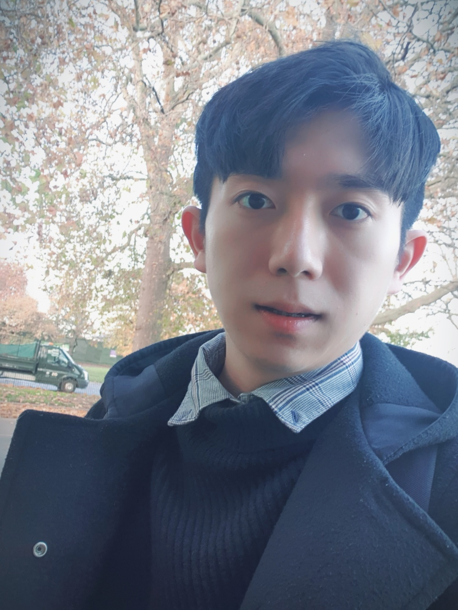

## About Me

Hi! I am a Ph.D student at Seoul National University. I am fortunate to be advised by Prof. [Kyomin Jung](http://milab.snu.ac.kr/kjung/index.html).

[Email](https://mail.google.com/mail/u/0/?fs=1&tf=cm&source=mailto&to=minbeomkim@snu.ac.kr)  [GitHub](https://github.com/minbeomkim)  [LinkedIn](https://www.linkedin.com/in/mbkimm/)

## Research Interest

My research is broadly in machine learning and natural language process. I am currently interested in learning representation about multi-modal knowledge of the world and knowledge grounded dialogue. 

## Professional Experience

## Publications

1. Changyeop shin, Minbeom Kim, Sungho Kim and Youngjung Kim. ”Stacked lossless deconvolutional network for remote sensing image restoration”. 𝐽𝑜𝑢𝑟𝑛𝑎𝑙 𝑜𝑓 𝐴𝑝𝑝𝑙𝑖𝑒𝑑 𝑅𝑒𝑚𝑜𝑡𝑒 𝑆𝑒𝑛𝑠𝑖𝑛𝑔. 016511, Feb 2020.
2. Changyeop Shin,Minbeom Kim, Sungho Kim and Youngjung Kim. ”Stacked lossless deconvolutional network for remote sensing image super-resolution”. 𝑆𝑃𝐼𝐸 𝐼𝑚𝑎𝑔𝑒 𝑎𝑛𝑑 𝑆𝑖𝑔𝑛𝑎𝑙 𝑃𝑟𝑜𝑐𝑒𝑠𝑠𝑖𝑛𝑔 𝑓𝑜𝑟 𝑅𝑒𝑚𝑜𝑡𝑒 𝑆𝑒𝑛𝑠𝑖𝑛𝑔. 1115509, Sep 2019.
3.  Minbeom Kim, Sungho Kim and Youngjung Kim. ”Deep GPS Spoofing Detection”. 𝐾𝐼𝑀𝑆𝑇 , June 2019
4.  Jianrui Cai, Minbeom Kim, Youngjung Kim, et al. ”NTIRE 2019 Challenge on Real Image Super-Resolution:Methods and Results”. 𝐶𝑉𝑃𝑅 𝑤𝑜𝑟𝑘𝑠ℎ𝑜𝑝 2019, June 2019.

## Honors and Awards

## Patent
