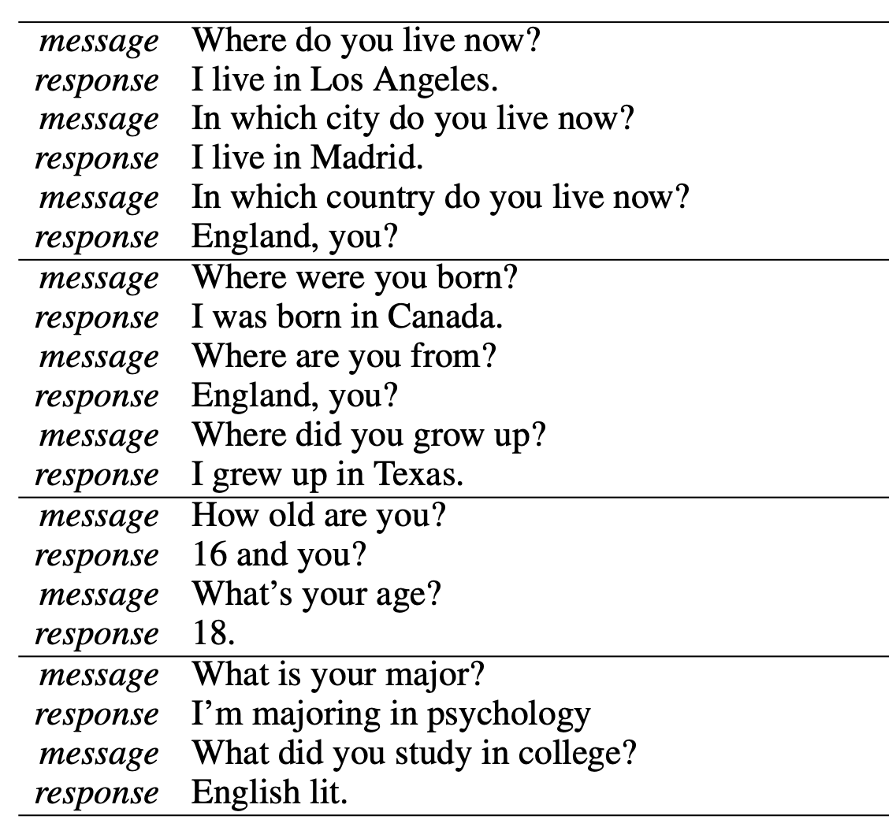
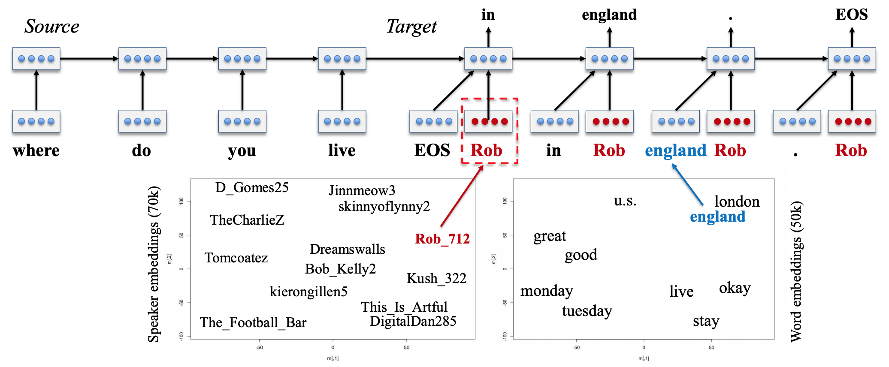

## A Persona-Based Neural Conversational Model

Jiwei Li, Michel Galley, Chris Brockett, Georgios P. Spithourakis, Jianfeng Gao, William B. Dolan; **ACL 2016**

[[link]](https://aclanthology.org/P16-1094.pdf)
---

**Summary**

When learning with the seq2seq methodology for given specific dataset, the consistency of speaker information can be broken because of only learning from the viewpoint of minimizing perplexity. Of course, it is possible to solve this problem to some extent by putting input query with dialogue, even in a short conversation, the speaker's attribute must be maintained to develop into a more practical language model. Therefore, this paper proposed the model that learns the speaker's persona and enables response generation reflecting the persona of both conversational subjects.

This research proposed two modules to solve this motivation; (1) **speaker model**, a language model infused with persona, and (2) **speaker-addressee model**, an extension of (1) for interactive conversation when considering the persona of the other person.

---
**My opinion**

I think it's a monumental research. Considering the significance of this work, first of all, this paper aims to inject persona-consistency in order for meaningful role of language model, which is learned from only the perplexity point of view. Second, considering the overall process of creating a chatbot system, the reason why language model's learning methods with autoregressive or unsupervised settings are in the limelight is that it is too expensive human-cost for adding task-dependent labels to sentence-level supervision. Therefore, while the language model learns from the perspective of perplexity, if other meaningful characteristics are possessed through external representation, the possibility of attribute-controllable generation is also promised and human-cost efficient learning is possible for each detailed task. This work does not require any other human costs. The third significant part is that persona-consistency contributes to the robustness and compositional generalization of the chatbot through this methodology. Since persona is a dense representation, it can be used while maintaining attribute-consistency even to words that are not in context, and information (that is not explicitly provided) from a similar persona representation can be referenced and responded to in a good language generation.

 
 
 
