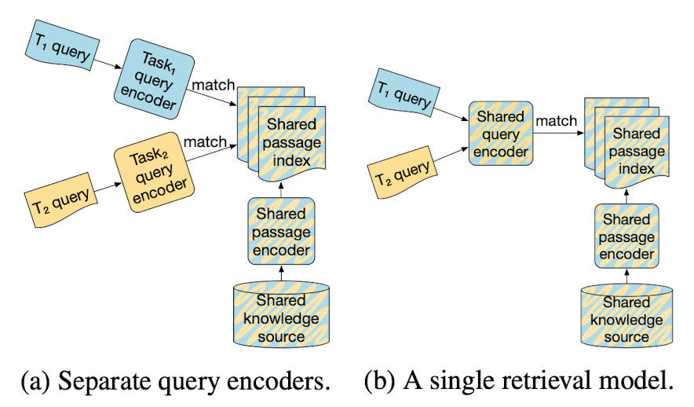
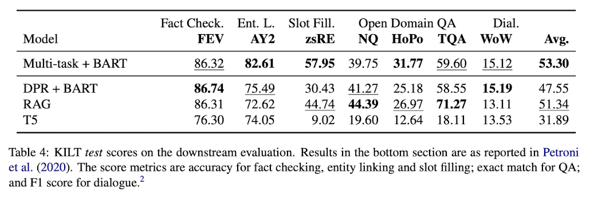
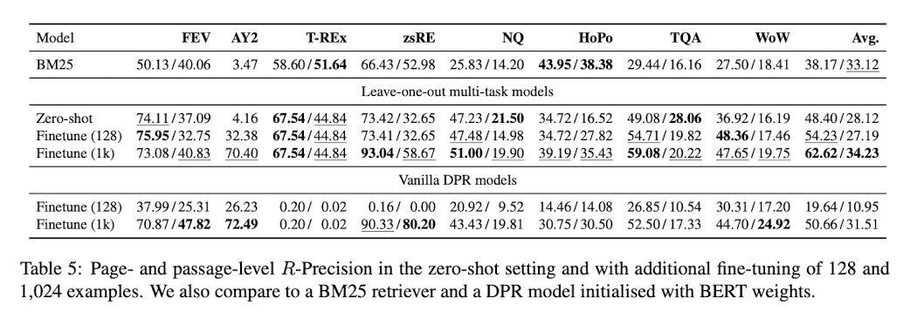

## CoLV: A Collaborative Latent Variable Model for Knowledge-Grounded Dialogue Generation

Haolan Zhan1, Lei Shen, Hongshen Chen, and Hainan Zhang; EMNLP 2021

[[link]](https://aclanthology.org/2021.emnlp-main.172.pdf)
---

**Summary**

Knowledge-intensive tasks require a lot of knowledge of the world by their nature. Therefore, an efficient information retrieval system (finding a small subset of relevant information) is needed for practical NLP engineering. It is largely divided into two methodologies. First, there are statistic based sparse representation methodologies such as tf-idf and BM25, and the others are dense representation methodologies such as ICT, DPR and RAG, which turned them into learnable modules through a neural network. In each specific knowledge-intensive task, the methodology through neural-networks exceeds statistics based(or count-based), but performance drops significantly in the out-of-distribution and low data regimes (few shot, zero shot). Therefore, universal neural retrieval method is required.

Existing state-of-the-arts learned task-specific query encoders, but this proposed methodology seeks to obtain a regularization effect for generalization ability taking universal intuition obtained by only one multi-tasks trained encoder. For comparison, KILT dataset, consisting of five knowledge-intensive tasks (i.e., question answering, slot filling, fact checking, dialogue, entity linking), was experimented.

From the experimental results, the shared query encoder was overall better than the task-specific query encoders. In particular, it was robust for more knowledge-intensive tasks that required multi-hop reasoning. This is because the regularization effect is strengthened by learning not only features for specific tasks but also universal features by performing multi-task learning internally in KILT.

In addition, in the zero-shot and few-shot settings, where the neural net hardly exerts power, it was overall superior to the statistical algorithm methods such as BM25.

---
**My opinion**

Not only maximizing the user experience or physically replacing repetitive labor, the value that AI can contribute is also promising to help people better perform knowledge-intensive tasks through the knowledge assistance. Therefore, it is necessary to develop a methodology for necessary information retrieval through multi-hop reasoning from indirect given clues. Unlike the benchmark datasets, in the real world, artificial intelligence may need to find information in a free-form knowledge base such as documents, and sometimes depending on the task, necessary to find the knowledge in the open domain, out-of-distribution, and even zero-shot setting. Neural nets are very clever learnable models with abundant datasets, but they should be able to perform well in these low data regimes. Therefore, like the proposed methodology, it should be possible to find a universal retrieval intuition that penetrates the entire system while learning abount various tasks, and to use it as a regularization effect for generalization as expressed in this paper. This paper presents motivation from this perspective as a very promising direction and has been experimentally proven.

 
 
 
